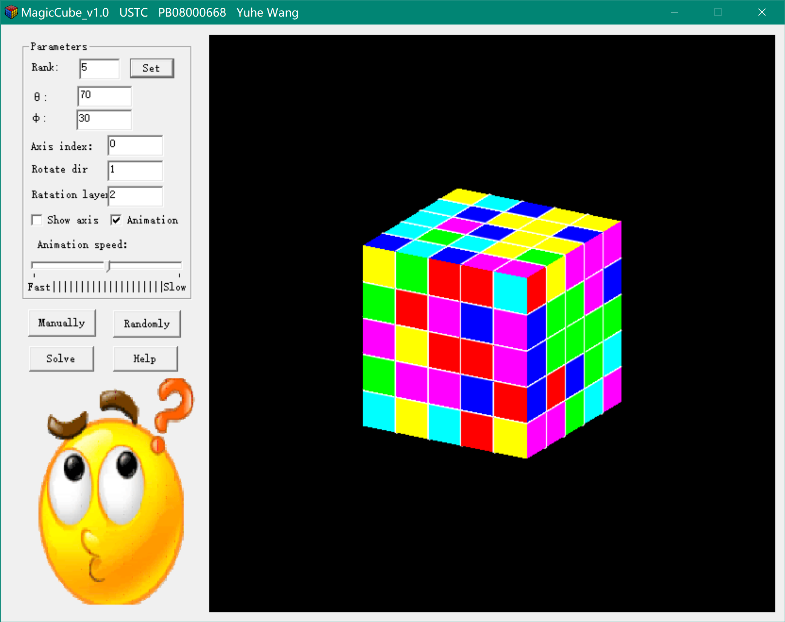

# MagicCube

This is a funny project that took me a winter holiday to finish. You can set an arbitrary rank of the Rubik's cube, disarrange it, and try to solve it manually by clicking and sliding your mouse. Or you can let the program solve a 3~5 rank disarranged Rubik's cube automatically for you in the form of animation. You can view the cube in any viewpoint, and control the speed of the animation so that you can follow this program to solve a real Rubik's cube in your hand.

